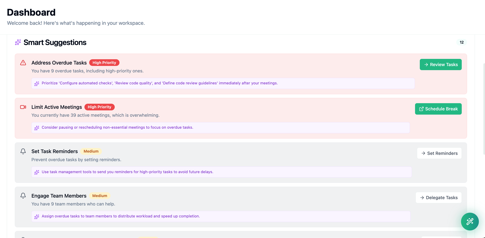
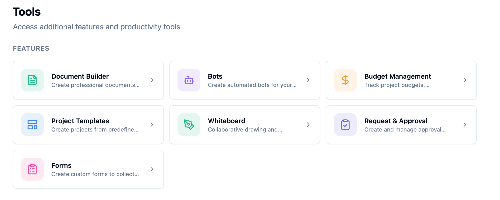

<p align="center">
  <a href="https://deskive.com">
    
  </a>
</p>

<p align="center">
  <h1 align="center">Deskive</h1>
  <p align="center">
    <strong>Open-source workspace collaboration platform</strong>
  </p>
  <p align="center">
    Real-time chat, video calls, project management, file sharing, calendar, notes, AI tools -- all in one place.
  </p>
</p>

<p align="center">
  
</p>

<p align="center">
  <a href="https://github.com/deskive/deskive/blob/main/LICENSE"></a>
  <a href="https://github.com/deskive/deskive/stargazers"></a>
  <a href="https://github.com/deskive/deskive/issues"></a>
  <a href="https://github.com/deskive/deskive/pulls"></a>
</p>

<p align="center">
  <a href="https://deskive.com">Website</a> |
  <a href="#quick-start">Quick Start</a> |
  <a href="https://github.com/deskive/deskive/discussions">Discussions</a> |
  <a href="CONTRIBUTING.md">Contributing</a>
</p>

<p align="center">
  <a href="./README.md">🇬🇧 English</a> |
  <a href="./README_JA.md">🇯🇵 日本語</a> |
  <a href="./README_ZH.md">🇨🇳 中文</a> |
  <a href="./README_KO.md">🇰🇷 한국어</a> |
  <a href="./README_ES.md">🇪🇸 Español</a> |
  <a href="./README_FR.md">🇫🇷 Français</a> |
  <a href="./README_DE.md">🇩🇪 Deutsch</a> |
  <a href="./README_PT-BR.md">🇧🇷 Português</a> |
  <a href="./README_RU.md">🇷🇺 Русский</a> |
  <a href="./README_HI.md">🇮🇳 हिन्दी</a> |
  <a href="./README_AR.md">🇸🇦 العربية</a>
</p>

---

## What is Deskive?

Deskive is a **self-hostable workspace collaboration platform** that brings together real-time communication, project management, and productivity tools. Built for teams who want complete control over their data, Deskive gives you Slack + Notion + Zoom + Asana functionality in a single open-source application.

Unlike Slack that requires paid plans for video calls or Notion that lacks real-time chat, Deskive gives you everything you need to collaborate effectively -- chat, video calls, project boards, file sharing, AI assistance -- without vendor lock-in or proprietary licensing.

<p align="center">
  
  <br>
  <em>Deskive workspace dashboard with integrated communication and project management</em>
</p>

### How It Works

1. **Create Your Workspace** -- Set up team workspaces with channels, projects, and custom roles
2. **Communicate in Real-Time** -- Chat with threads, reactions, mentions, GIFs, and HD video calls
3. **Manage Projects** -- Organize work with Kanban boards, sprints, task dependencies, and time tracking
4. **Collaborate on Documents** -- Share notes, whiteboards, files with version control and digital signatures
5. **Automate with AI** -- AutoPilot has full access across the entire app and can automate anything -- scheduling, messages, project updates, and more
6. **Get Smart Suggestions** -- AI analyzes your data and suggests tasks, actions, and priorities right from the dashboard

### Key Capabilities

- **💬 Real-Time Communication** -- Channels, direct messages, threads, reactions, mentions, and GIF support
- **📹 HD Video Conferencing** -- Built-in video calls with screen sharing, recording, and transcription via LiveKit
- **📋 Project Management** -- Kanban boards, sprints, milestones, task dependencies, and time tracking
- **📁 File Management** -- Cloud storage with versioning, sharing, and Google Drive integration
- **📝 Collaborative Notes** -- Block-based editor with real-time collaboration and templates
- **📅 Calendar & Scheduling** -- Event management, recurring events, meeting rooms, and availability tracking
- **🎨 Whiteboard** -- Visual collaboration workspace for brainstorming and planning
- **🤖 AutoPilot AI Agent** -- Fully autonomous AI assistant with access to the entire app -- automates tasks, schedules meetings, sends messages, manages projects, and handles workflows across all modules
- **🧠 Smart Suggestions** -- AI-powered dashboard suggestions that analyze your activity, projects, and deadlines to recommend tasks and priorities
- **🧰 Built-in Tools** -- Ready-to-use productivity tools for everyday tasks -- polls, reminders, time tracking, templates, and more -- no extra setup needed
- **🔌 Connectors** -- 180+ third-party app connectors with 6+ pre-wired OAuth integrations including Slack, Google Drive, GitHub, Dropbox, Gmail, and more
- **📊 Forms & Analytics** -- Custom form builder with response tracking and workspace metrics
- **✅ Approval Workflows** -- Built-in approval system for documents and processes
- **💰 Budget Tracking** -- Expense management, billing rates, and budget monitoring
- **🔍 Semantic Search** -- AI-powered search across all content types
- **🌍 Internationalization** -- Multi-language support (English, Japanese, expandable)

### Feature Highlights

<p align="center">
  <strong>🤖 AutoPilot AI Agent</strong><br>
  <em>Fully autonomous AI assistant with access to the entire app -- ask it anything, automate everything</em><br><br>
  
</p>

<p align="center">
  <strong>🧠 Smart Suggestions</strong><br>
  <em>AI analyzes your activity and deadlines to recommend tasks and priorities right from the dashboard</em><br><br>
  
</p>

<p align="center">
  <strong>🧰 Built-in Tools</strong><br>
  <em>Ready-to-use productivity tools -- document builder, bots, budgets, whiteboards, forms, and more</em><br><br>
  
</p>

<p align="center">
  <strong>🔌 Connectors</strong><br>
  <em>180+ third-party app connectors with pre-wired OAuth for Gmail, Google Calendar, Drive, GitHub, Dropbox, and more</em><br><br>
  
</p>

## What Problem We Solve

### The Collaboration Tool Fragmentation Dilemma

Modern teams juggle multiple subscriptions: Slack for chat ($8.75/user/mo), Zoom for video ($15.99/user/mo), Asana for projects ($10.99/user/mo), Notion for docs ($10/user/mo). This creates fragmented workflows, data silos, security risks from multiple vendors, and costs that scale linearly with team size.

**Common pain points we address:**

- ❌ **Tool Fragmentation** -- Switching between 5+ tools daily disrupts focus and productivity
- ❌ **Rising Costs** -- SaaS subscriptions add up to $50+/user/month for basic collaboration
- ❌ **Data Lock-In** -- Your data lives on someone else's servers with limited export options
- ❌ **Privacy Concerns** -- Sensitive business data shared with multiple third-party vendors
- ❌ **Integration Complexity** -- Each tool requires separate API integrations and authentication
- ❌ **Feature Gaps** -- No single platform offers comprehensive collaboration features

### Deskive's Solution

✅ **All-in-One Platform** -- Chat, video, projects, files, calendar, notes, and AI in one application

✅ **Self-Hosted & Open Source** -- Complete data ownership with GNU AGPL 3.0 license

✅ **Zero Per-User Costs** -- One infrastructure cost regardless of team size

✅ **Deep Integration** -- All features share context and data seamlessly

✅ **Enterprise-Ready** -- Digital signatures, approval workflows, audit logs, and SSO support

## Why Deskive? (Comparison)

| Feature | Deskive | Slack | Notion | Asana | Microsoft Teams |
|---------|---------|-------|--------|-------|-----------------|
| **Real-time Chat** | ✅ Channels, threads, reactions | ✅ | ⚠️ Comments only | ⚠️ Comments only | ✅ |
| **Video Calls** | ✅ HD, recording, transcription | ⚠️ Huddles (basic) | ❌ | ❌ | ✅ |
| **Project Management** | ✅ Kanban, sprints, dependencies | ❌ | ⚠️ Basic boards | ✅ Full-featured | ⚠️ Planner |
| **File Management** | ✅ Versioning, sharing, Drive sync | ⚠️ Basic uploads | ⚠️ Embedded | ⚠️ Attachments | ✅ SharePoint |
| **Notes & Docs** | ✅ Block editor, real-time collab | ⚠️ Canvas (basic) | ✅ Full-featured | ❌ | ⚠️ Loop |
| **Calendar** | ✅ Events, rooms, availability | ❌ | ❌ | ⚠️ Timeline view | ✅ |
| **Whiteboard** | ✅ Collaborative workspace | ❌ | ❌ | ❌ | ✅ |
| **AI Assistant** | ✅ AutoPilot, meeting intel | ⚠️ Summary | ⚠️ Writing | ⚠️ Status | ✅ Copilot |
| **Forms Builder** | ✅ Custom forms with analytics | ❌ | ❌ | ✅ | ✅ |
| **Budget Tracking** | ✅ Expenses, billing, budgets | ❌ | ❌ | ❌ | ❌ |
| **Approval Workflows** | ✅ Built-in system | ⚠️ Workflow Builder | ❌ | ✅ | ✅ Power Automate |
| **Bot Automation** | ✅ Custom bots, triggers/actions | ✅ Bolt SDK | ❌ | ⚠️ Rules | ✅ Power Automate |
| **Email Integration** | ✅ Gmail OAuth, SMTP/IMAP | ❌ | ❌ | ⚠️ Email-to-task | ✅ Outlook |
| **Self-Hosted** | ✅ Docker Compose | ❌ | ❌ | ❌ | ❌ |
| **Open Source** | ✅ GNU AGPL 3.0 | ❌ | ❌ | ❌ | ❌ |
| **Desktop Apps** | ✅ Tauri (Mac, Win, Linux) | ✅ Electron | ✅ Electron | ❌ | ✅ Electron |
| **Learning Curve** | 🟢 Low | 🟢 Low | 🟡 Medium | 🟡 Medium | 🔴 High |
| **Pricing** | 🟢 Free (self-hosted) | 💰 $8.75/user/mo | 💰 $10/user/mo | 💰 $10.99/user/mo | 💰 $4/user/mo |

### Deskive vs Open-Source Alternatives

The proprietary comparison above is the "should I stop paying Slack + Notion + Asana" story. If you're comparing against other open-source workspace tools, this is the honest picture. Specialist tools beat us on depth per pillar; nobody else ships every pillar in one repo.

| Feature | **Deskive** | [AppFlowy](https://github.com/AppFlowy-IO/AppFlowy) | [Huly](https://github.com/hcengineering/platform) | [Plane](https://github.com/makeplane/plane) | [Nextcloud Hub](https://github.com/nextcloud/server) | [Mattermost](https://github.com/mattermost/mattermost) |
|---|---|---|---|---|---|---|
| **Real-time Chat** | ✅ Channels, threads, reactions | ❌ | ✅ | ❌ | ✅ Talk | ✅ Best-in-class |
| **Video Calls** | ✅ HD, recording, transcription (LiveKit) | ❌ | ✅ Virtual office | ❌ | ✅ Talk | ⚠️ Basic calls |
| **Docs / Notes** | ✅ Tiptap + Yjs block editor | ✅ Best-in-class | ✅ Deep | ⚠️ Pages | ✅ OnlyOffice/Collabora | ❌ |
| **Project Management** | ✅ Kanban, sprints, milestones | ⚠️ Board view | ✅ Linear-grade tracker | ✅ Cycles + modules | ⚠️ Deck plugin | ⚠️ Boards (ex-Focalboard) |
| **Whiteboard** | ✅ Excalidraw-based | ❌ | ❌ | ❌ | ⚠️ Optional app | ❌ |
| **Calendar** | ✅ Events, rooms, availability | ❌ | ⚠️ Team planner | ❌ | ✅ Groupware | ❌ |
| **Forms Builder** | ✅ 19 field types, analytics | ⚠️ Grid view | ❌ | ❌ | ⚠️ Optional app | ❌ |
| **Approvals** | ✅ Built-in workflows | ❌ | ❌ | ❌ | ⚠️ Flow | ⚠️ Playbooks |
| **Budget Tracking** | ✅ Expenses, billing | ❌ | ❌ | ❌ | ❌ | ❌ |
| **AI Agent** | ✅ AutoPilot + vector search | ✅ Local LLMs (Mistral/Llama) | 📋 Coming soon | ⚠️ Pages assist | ✅ Assistant | ⚠️ Copilot |
| **Bots / Automation** | ✅ Custom bots, triggers | ❌ | ❌ | ⚠️ | ✅ Flow | ✅ Webhooks |
| **Integrations Catalog** | **180+ in catalog, 6+ pre-wired OAuth** | ~1 (Zapier link) | 1 (GitHub bidi) | ~16 (GH, GL, Slack, Sentry, + importers) | 200+ (Nextcloud app store) | ~40–50 (marketplace) |
| **Plugin Marketplace** | ❌ *(catalog is static, no third-party)* | ❌ | ❌ | ❌ | ✅ Best-in-class | ✅ |
| **Self-Hosted** | ✅ Docker Compose | ✅ | ✅ | ✅ | ✅ | ✅ |
| **Pluggable Providers** *(storage / AI / email / push / search / auth)* | ✅ All 7 swappable via env var | ❌ | ❌ | ❌ | ❌ (plugins) | ❌ (plugins) |

**Honest summary:**

- **On depth per feature**, specialists win their category: AppFlowy has the richer docs editor, Huly has a deeper Linear-grade tracker, Plane has more mature cycles/modules, Mattermost is production-proven chat at scale, Nextcloud has the biggest app ecosystem. We lose a 1v1 on any single pillar.
- **On breadth under one data model**, we're the only OSS project shipping all 12 pillars natively in one repo under one login and one permission model. Huly comes closest but has no forms / approvals / budget / whiteboard. That "one unified workspace" story is real and not marketing.
- **On the pluggable-provider pattern** (swap storage / AI / email / push / search / auth / video at the env-var level), we're the only one doing it — every other project hardcodes its backing services.

If you need *one* tool for *all* of chat + video + docs + PM + forms + approvals + budget + AI — and you want to swap the infrastructure freely — deskive is the clearest choice today. If you need only one of those pillars and care about maximum depth on it, the specialist probably wins.

### What Makes Deskive Unique?

1. **Truly Unified Platform** -- All features share the same data model and permission model; a task, a chat message, a doc, and a calendar event are first-class citizens of the same workspace
2. **Pluggable Infrastructure** -- Storage, AI, email, push, search, auth, and video backends are all swappable via env var. Move from R2 to GCS, OpenAI to Ollama, Gmail to Postmark, LiveKit to Jitsi — no code changes
3. **Self-Hosting Without Compromise** -- Full feature parity with SaaS alternatives, including video calls and AI
4. **Modern Tech Stack** -- Built with React 19, NestJS 11, TypeScript, Tiptap/Yjs, Excalidraw, LiveKit, and Qdrant
5. **AI-Native Design** -- Vector search, conversation memory, and AutoPilot agent built into the core platform
6. **Cost-Effective Scaling** -- One infrastructure cost serves unlimited users, unlike per-seat SaaS pricing

## 📊 Project Activity & Statistics

Deskive is an **actively maintained** project with a growing community. Here's what's happening:

### GitHub Activity

<p align="left">
  
  
  
  
</p>

<p align="left">
  
  
  
  
</p>

### Community Metrics

| Metric | Status | Details |
|--------|--------|---------|
| **Total Contributors** |  | Growing community of developers worldwide |
| **Total Commits** |  | Active development since inception |
| **Monthly Commits** |  | Regular updates and improvements |
| **Code Quality** |  | TypeScript, ESLint, Prettier enforced |
| **Documentation** |  | Detailed guides and API documentation |

### Language & Code Statistics

<p align="left">
  
  
  
  
</p>

### Recent Activity Highlights

- ✅ **40+ Modules** -- Comprehensive backend API with modular architecture
- ✅ **148 Database Tables** -- Production-ready schema with migrations
- ✅ **HD Video Conferencing** -- LiveKit integration with recording and transcription
- ✅ **AI AutoPilot** -- Fully autonomous AI agent with app-wide access for end-to-end task automation
- ✅ **Smart Suggestions** -- AI-driven dashboard that analyzes user data to recommend tasks and priorities
- ✅ **180+ Connectors** -- Third-party app integrations with pre-wired OAuth for Slack, GitHub, Google, and more
- ✅ **Multi-Language Support** -- i18n with English and Japanese
- ✅ **Desktop Apps** -- Tauri-based apps for macOS, Windows, and Linux

### Why These Numbers Matter

**Active Maintenance** -- Regular commits and quick response to issues show the project is actively maintained and supported

**Modern Codebase** -- TypeScript throughout ensures type safety, better developer experience, and fewer runtime errors

**Production-Ready** -- Comprehensive feature set with 40+ backend modules demonstrates maturity beyond MVP stage

**Community Growth** -- Growing contributor base and active discussions indicate healthy community engagement

**Open Development** -- All development happens in public with transparent decision-making and roadmap

### Join the Activity!

Want to see your contributions here? Check out our [Quick Contribution Guide](#-quick-contribution-guide) below!

## Quick Start

### Docker (Recommended)

Run these commands from the project root:

```bash
git clone https://github.com/deskive/deskive.git
cd deskive
cp .env.docker .env
# Edit .env with your configuration (database credentials, API keys, etc.)
docker compose up -d
```

That's it! Access the app at `http://localhost:5175` and the API at `http://localhost:3000`.

### Manual Setup

**Prerequisites:** Node.js 20+, PostgreSQL 15+, Redis 7+

```bash
# Clone
git clone https://github.com/deskive/deskive.git
cd deskive

# Backend
cd backend
cp .env.example .env    # Edit .env with your configuration
npm install
npm run migrate         # Run database migrations
npm run start:dev

# Frontend (in a new terminal)
cd frontend
cp .env.example .env
npm install
npm run dev
```

Frontend: `http://localhost:5175` | Backend: `http://localhost:3000`

### One-Command Start

For development environments:

```bash
./start.sh
```

## Architecture

<div align="center">

```
┌─────────────────────────────────────────────────────────────┐
│                     Frontend (React 19)                     │
│  ┌──────────┐  ┌──────────┐  ┌──────────┐  ┌──────────┐     │
│  │   Chat   │  │ Projects │  │  Files   │  │ Calendar │     │
│  └──────────┘  └──────────┘  └──────────┘  └──────────┘     │
│         Vite + TypeScript + Tailwind CSS + Radix UI         │
└────────────────────────┬────────────────────────────────────┘
                         │ REST API + Socket.io
┌────────────────────────┴────────────────────────────────────┐
│                    Backend (NestJS 11)                      │
│  ┌──────────┐  ┌──────────┐  ┌──────────┐  ┌──────────┐     │
│  │   Auth   │  │   Chat   │  │  Tasks   │  │    AI    │     │
│  └──────────┘  └──────────┘  └──────────┘  └──────────┘     │
│         40+ Modules with TypeScript + Raw SQL               │
└────────┬─────────────┬─────────────┬─────────────┬──────────┘
         │             │             │             │
    ┌────┴────┐   ┌────┴────┐  ┌────┴────┐   ┌────┴────┐
    │Postgres │   │  Redis  │  │ Qdrant  │   │LiveKit  │
    │(Storage)│   │(Cache)  │  │(Vector) │   │(Video)  │
    └─────────┘   └─────────┘  └─────────┘   └─────────┘
```

</div>

**Frontend** (`/frontend`) -- React 19 with Vite, TypeScript, Tailwind CSS, Radix UI components, Zustand for state management, React Query for data fetching

**Backend** (`/backend`) -- NestJS 11 with TypeScript, PostgreSQL with raw SQL queries, Redis for caching and real-time features, Socket.io for WebSocket connections

**AI & Search** -- Qdrant for vector embeddings, OpenAI for GPT-4o-mini and Whisper transcription

**Video** -- LiveKit for HD video calls, screen sharing, recording, and real-time transcription

## Feature Modules

Deskive ships with 40+ integrated modules across these categories:

| Category | Modules |
|----------|---------|
| **Communication** | Chat (channels, DMs, threads), Video Calls (HD, recording), Email (Gmail OAuth, SMTP/IMAP), Notifications |
| **Project Management** | Tasks, Milestones, Sprints, Kanban Boards, Time Tracking, Dependencies, Labels |
| **Content** | Notes (block editor), Documents (digital signatures), Whiteboards, File Management (versioning, sharing) |
| **Productivity** | Calendar (events, rooms), Forms (builder, analytics), Approvals (workflows), Budgets (expenses, billing), Built-in Tools (polls, reminders, templates) |
| **AI & Automation** | AutoPilot (full app-wide autonomous agent), Smart Suggestions (AI-driven task recommendations), Meeting Intelligence, Document Analysis, Bots (triggers, actions, scheduling) |
| **Platform** | Auth (OAuth, SSO), Workspace Management, Roles & Permissions, Search (semantic), Analytics, 180+ Connectors (Slack, GitHub, Google, Dropbox, and more) |

[View detailed feature documentation &rarr;](https://github.com/deskive/deskive/wiki)

## Pluggable Providers

Every backing service is swappable via a single env var. Defaults keep Deskive runnable with zero cloud credentials; swap in a managed provider when you're ready.

| Domain | Env var | Providers shipped |
|---|---|---|
| **Storage** (PR [#28](https://github.com/deskive/deskive/pull/28)) | `STORAGE_PROVIDER` | `local-fs` (default), `s3`, `r2`, `minio`, `b2`, `gcs`, `azure`, `none` |
| **Email** (PR [#30](https://github.com/deskive/deskive/pull/30)) | `EMAIL_PROVIDER` | `smtp`, `resend`, `sendgrid`, `postmark`, `ses`, `mailgun`, `none` |
| **Push** (PR [#31](https://github.com/deskive/deskive/pull/31)) | `PUSH_PROVIDER` | `webpush`, `fcm`, `onesignal`, `expo`, `none` |
| **Search** (PR [#32](https://github.com/deskive/deskive/pull/32)) | `SEARCH_PROVIDER` | `pg-trgm` (default, zero extra infra), `meilisearch`, `typesense`, `none` |
| **Auth / SSO** (PR [#33](https://github.com/deskive/deskive/pull/33)) | `AUTH_PROVIDERS` | `local`, `google`, `github`, `magic-link` (passwordless, JWT-based) |
| **Video** | `VIDEO_PROVIDER` | `livekit`, `jitsi`, `daily`, `agora`, `whereby`, `none` |
| **AI** | `AI_PROVIDER` | `openai`, `anthropic`, `gemini`, `groq`, `ollama` (local) |

- **Keyword + semantic search coexist.** `SearchProviderService` handles trigram/faceted keyword search; `SearchService` keeps handling Qdrant vector/semantic search.
- **Optional SDKs are lazy-loaded** — `@azure/storage-blob`, `@google-cloud/storage`, `firebase-admin`, `livekit-server-sdk`, and `agora-token` are `optionalDependencies`, so picking `local-fs` / `smtp` / `webpush` / `pg-trgm` adds zero install cost.
- **Smoke tests** ship with each adapter (`backend/scripts/smoke-test-*-providers.ts`) — 27 / 45 / 61 / 55 / 37 assertions for storage / email / push / search / auth respectively, all passing.
- **Full docs:** see `backend/docs/providers/` for per-provider env vars and setup.

## i18n

Deskive supports multiple languages via react-i18next:

- English (en), Japanese (ja)

Want to add a new language? Contribute translations in `frontend/src/i18n/locales/`. See the [translation guide](CONTRIBUTING.md).

## 🚀 Why Contribute to Deskive?

Deskive is more than just another open-source project -- it's an opportunity to build the future of team collaboration while mastering modern development practices.

### What You'll Gain

**📚 Learn Modern Tech Stack**
- **React 19** -- Latest React with concurrent features and server components
- **NestJS 11** -- Enterprise-grade Node.js framework with dependency injection
- **TypeScript Throughout** -- Strong typing, better IDE support, fewer bugs
- **PostgreSQL + Raw SQL** -- Database design without ORM magic
- **Real-Time Systems** -- Socket.io for WebSockets, Redis for pub/sub
- **AI Integration** -- OpenAI embeddings, vector search with Qdrant

**💼 Build Your Portfolio**
- Contribute to a **production-ready** platform used by teams worldwide
- Work on features that appear on your GitHub profile
- Get recognition in our contributor hall of fame
- Build expertise in **collaboration platforms** and **real-time systems** -- highly valued skills in 2026

**🤝 Join a Growing Community**
- Connect with developers from around the world
- Get code reviews from experienced maintainers
- Learn best practices in software architecture
- Participate in technical discussions and design decisions

**🎯 Make Real Impact**
- Your code will help teams break free from expensive SaaS subscriptions
- See your features being used in production environments
- Influence the direction of open-source collaboration tools

**⚡ Quick Onboarding**
- Docker Compose gets you running in **under 5 minutes**
- Well-documented codebase with clear architecture
- Friendly maintainers who respond to PRs within 48 hours
- "Good first issue" labels for newcomers

## 🎯 Quick Contribution Guide

Get started contributing in **under 10 minutes**:

### Step 1: Set Up Your Environment

```bash
# Fork the repository on GitHub, then clone your fork
git clone https://github.com/YOUR_USERNAME/deskive.git
cd deskive

# Start with Docker (easiest way)
cp .env.docker .env
docker compose up -d

# Access the app
# Frontend: http://localhost:5175
# Backend API: http://localhost:3000
```

**That's it!** You're running Deskive locally.

### Step 2: Find Something to Work On

Choose based on your experience level:

**🟢 Beginner-Friendly**
- 📝 [Fix typos or improve documentation](https://github.com/deskive/deskive/labels/documentation)
- 🌍 [Add translations](https://github.com/deskive/deskive/labels/i18n) -- We support English and Japanese
- 🐛 [Fix simple bugs](https://github.com/deskive/deskive/labels/good%20first%20issue)
- ✨ [Improve UI/UX](https://github.com/deskive/deskive/labels/ui%2Fux)

**🟡 Intermediate**
- 🔗 Add new integrations -- See our [Integration Guide](backend/README.md#integrations)
- 🧪 [Write tests](https://github.com/deskive/deskive/labels/tests)
- 🚀 [Performance improvements](https://github.com/deskive/deskive/labels/performance)
- 📱 [Mobile responsiveness](https://github.com/deskive/deskive/labels/mobile)

**🔴 Advanced**
- 🤖 [AI features](https://github.com/deskive/deskive/labels/ai) -- AutoPilot enhancements, new AI capabilities
- ⚙️ [Core engine enhancements](https://github.com/deskive/deskive/labels/core)
- 🏗️ [Architecture improvements](https://github.com/deskive/deskive/labels/architecture)
- 🔐 [Security features](https://github.com/deskive/deskive/labels/security)

### Step 3: Make Your Changes

```bash
# Create a new branch
git checkout -b feature/your-feature-name

# Make your changes
# - Backend code: /backend/src/modules
# - Frontend code: /frontend/src
# - Database migrations: /backend/migrations

# Test your changes
npm test

# Commit with a clear message
git commit -m "feat: add new integration for XYZ"
```

### Step 4: Submit Your Pull Request

```bash
# Push to your fork
git push origin feature/your-feature-name

# Open a PR on GitHub
# - Describe what you changed and why
# - Link to any related issues
# - Add screenshots if it's a UI change
```

**What happens next?**
- ✅ Automated tests run on your PR
- 👀 A maintainer reviews your code (usually within 48 hours)
- 💬 We may suggest changes or improvements
- 🎉 Once approved, your code gets merged!

### Contribution Tips

✨ **Start small** -- Your first PR doesn't need to be a huge feature

📖 **Read the code** -- Browse existing modules in `backend/src/modules` for reference

❓ **Ask questions** -- Open a [GitHub Discussion](https://github.com/deskive/deskive/discussions) if you're stuck

🧪 **Write tests** -- PRs with tests get merged faster

📝 **Document your code** -- Add comments for complex logic

### Need Help?

- 💡 [GitHub Discussions](https://github.com/deskive/deskive/discussions) -- Ask questions, share ideas
- 📖 [Contributing Guide](CONTRIBUTING.md) -- Detailed contribution guidelines
- 🐛 [GitHub Issues](https://github.com/deskive/deskive/issues) -- Report bugs or request features

## Contributing

We welcome contributions! See our [Contributing Guide](CONTRIBUTING.md) to get started.

**Ways to contribute:**
- Report bugs or request features via [GitHub Issues](https://github.com/deskive/deskive/issues)
- Submit pull requests for bug fixes or new features
- Add new integrations (see the [Integration Guide](backend/README.md#integrations))
- Improve documentation
- Add translations

## Contributors

Thank you to all the amazing people who have contributed to Deskive! 🎉

<a href="https://github.com/deskive/deskive/graphs/contributors">
  
</a>

Want to see your face here? Check out our [Contributing Guide](CONTRIBUTING.md) and start contributing today!

## 💬 Join Our Community

Connect with developers, get help, and stay updated on Deskive's latest developments!

<p align="center">
  <a href="https://github.com/deskive/deskive/discussions">
    
  </a>
</p>

### Where to Find Us

| Platform | Purpose | Link |
|----------|---------|------|
| 💡 **GitHub Discussions** | Ask questions, share ideas, feature requests | [Start Discussion](https://github.com/deskive/deskive/discussions) |
| 🐛 **GitHub Issues** | Bug reports, feature requests | [Open Issue](https://github.com/deskive/deskive/issues) |
| 🌐 **Website** | Documentation, guides, updates | [deskive.com](https://deskive.com) |

### Community Guidelines

- 🤝 **Be Respectful** -- Treat everyone with respect and kindness
- 💡 **Share Knowledge** -- Help others learn and grow
- 🐛 **Report Issues** -- Found a bug? Let us know on GitHub Issues
- 🎉 **Celebrate Wins** -- Share your Deskive implementations and use cases
- 🌍 **Think Global** -- We're a worldwide community supporting multiple languages

## License

This project is licensed under the [GNU Affero General Public License v3.0](LICENSE).

Copyright 2025 Deskive Contributors.

## Acknowledgments

Built with NestJS, React, PostgreSQL, Redis, TypeScript, Tailwind CSS, LiveKit, OpenAI, and Qdrant.

---

<p align="center">
  <a href="https://deskive.com">Website</a> |
  <a href="https://github.com/deskive/deskive/wiki">Docs</a> |
  <a href="https://github.com/deskive/deskive/discussions">Discussions</a>
</p>

---

<p align="center">
  <strong>Built with ❤️ by the <a href="https://github.com/deskive">Deskive</a> community</strong>
</p>

<p align="center">
  If you find this project useful, please consider giving it a star! ⭐
  <br><br>
  <a href="https://github.com/deskive/deskive/stargazers">
    
  </a>
</p>
