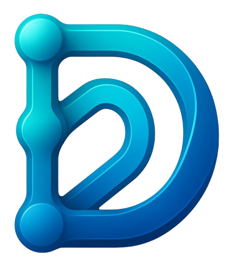
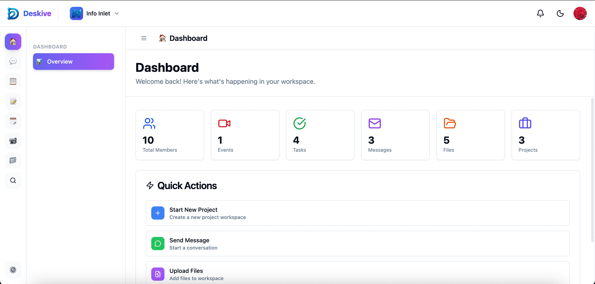

<p align="center">
  <a href="https://deskive.com">
    
  </a>
</p>

<p align="center">
  <h1 align="center">Deskive</h1>
  <p align="center">
    <strong>Plateforme de collaboration en espace de travail open-source</strong>
  </p>
  <p align="center">
    Chat en temps réel, appels vidéo, gestion de projet, partage de fichiers, calendrier, notes, outils IA -- tout en un seul endroit.
  </p>
</p>

<p align="center">
  <a href="https://github.com/deskive/deskive/blob/main/LICENSE"></a>
  <a href="https://github.com/deskive/deskive/stargazers"></a>
  <a href="https://github.com/deskive/deskive/issues"></a>
  <a href="https://github.com/deskive/deskive/pulls"></a>
</p>

<p align="center">
  <a href="https://deskive.com">Site Web</a> |
  <a href="#démarrage-rapide">Démarrage Rapide</a> |
  <a href="https://github.com/deskive/deskive/discussions">Discussions</a> |
  <a href="CONTRIBUTING.md">Contribuer</a>
</p>

<p align="center">
  <a href="./README.md">🇬🇧 English</a> |
  <a href="./README_JA.md">🇯🇵 日本語</a> |
  <a href="./README_ZH.md">🇨🇳 中文</a> |
  <a href="./README_KO.md">🇰🇷 한국어</a> |
  <a href="./README_ES.md">🇪🇸 Español</a> |
  <strong>Français</strong> |
  <a href="./README_DE.md">🇩🇪 Deutsch</a> |
  <a href="./README_PT-BR.md">🇧🇷 Português</a> |
  <a href="./README_RU.md">🇷🇺 Русский</a> |
  <a href="./README_HI.md">🇮🇳 हिन्दी</a> |
  <a href="./README_AR.md">🇸🇦 العربية</a>
</p>

---

## Qu'est-ce que Deskive ?

Deskive est une **plateforme de collaboration en espace de travail auto-hébergeable** qui rassemble la communication en temps réel, la gestion de projet et les outils de productivité. Conçue pour les équipes qui souhaitent un contrôle total sur leurs données, Deskive vous offre les fonctionnalités de Slack + Notion + Zoom + Asana dans une seule application open-source.

Contrairement à Slack qui nécessite des abonnements payants pour les appels vidéo ou Notion qui manque de chat en temps réel, Deskive vous donne tout ce dont vous avez besoin pour collaborer efficacement -- chat, appels vidéo, tableaux de projet, partage de fichiers, assistance IA -- sans verrouillage propriétaire ni licence restrictive.

<p align="center">
  
  <br>
  <em>Tableau de bord de l'espace de travail Deskive avec communication et gestion de projet intégrées</em>
</p>

### Comment ça fonctionne

1. **Créez votre espace de travail** -- Configurez des espaces de travail d'équipe avec des canaux, des projets et des rôles personnalisés
2. **Communiquez en temps réel** -- Discutez avec des fils de discussion, des réactions, des mentions, des GIF et des appels vidéo HD
3. **Gérez vos projets** -- Organisez le travail avec des tableaux Kanban, des sprints, des dépendances de tâches et un suivi du temps
4. **Collaborez sur des documents** -- Partagez des notes, des tableaux blancs, des fichiers avec contrôle de version et signatures numériques
5. **Automatisez avec l'IA** -- AutoPilot a un accès complet à toute l'application et peut tout automatiser -- planification, messages, mises à jour de projets et plus encore
6. **Obtenez des suggestions intelligentes** -- L'IA analyse vos données et suggère des tâches, des actions et des priorités directement depuis le tableau de bord

### Capacités clés

- **💬 Communication en temps réel** -- Canaux, messages directs, fils de discussion, réactions, mentions et support GIF
- **📹 Visioconférence HD** -- Appels vidéo intégrés avec partage d'écran, enregistrement et transcription via LiveKit
- **📋 Gestion de projet** -- Tableaux Kanban, sprints, jalons, dépendances de tâches et suivi du temps
- **📁 Gestion de fichiers** -- Stockage cloud avec versionnage, partage et intégration Google Drive
- **📝 Notes collaboratives** -- Éditeur par blocs avec collaboration en temps réel et modèles
- **📅 Calendrier et planification** -- Gestion d'événements, événements récurrents, salles de réunion et suivi de disponibilité
- **🎨 Tableau blanc** -- Espace de collaboration visuel pour le brainstorming et la planification
- **🤖 Agent IA AutoPilot** -- Assistant IA entièrement autonome avec accès à toute l'application -- automatise les tâches, planifie les réunions, envoie des messages, gère les projets et traite les flux de travail dans tous les modules
- **🧠 Suggestions intelligentes** -- Suggestions de tableau de bord alimentées par l'IA qui analysent votre activité, vos projets et vos échéances pour recommander des tâches et des priorités
- **🧰 Outils intégrés** -- Outils de productivité prêts à l'emploi pour les tâches quotidiennes -- sondages, rappels, suivi du temps, modèles et plus -- aucune configuration supplémentaire nécessaire
- **🔌 Connecteurs** -- Plus de 180 connecteurs d'applications tierces avec plus de 6 intégrations OAuth préconfigurées incluant Slack, Google Drive, GitHub, Dropbox, Gmail et plus
- **📊 Formulaires et analytiques** -- Générateur de formulaires personnalisés avec suivi des réponses et métriques d'espace de travail
- **✅ Flux d'approbation** -- Système d'approbation intégré pour les documents et les processus
- **💰 Suivi budgétaire** -- Gestion des dépenses, tarifs de facturation et surveillance du budget
- **🔍 Recherche sémantique** -- Recherche alimentée par l'IA sur tous les types de contenu
- **🌍 Internationalisation** -- Support multilingue (anglais, japonais, extensible)

## Quel problème résolvons-nous

### Le dilemme de la fragmentation des outils de collaboration

Les équipes modernes jonglent avec de multiples abonnements : Slack pour le chat (8,75 $/utilisateur/mois), Zoom pour la vidéo (15,99 $/utilisateur/mois), Asana pour les projets (10,99 $/utilisateur/mois), Notion pour les documents (10 $/utilisateur/mois). Cela crée des flux de travail fragmentés, des silos de données, des risques de sécurité provenant de plusieurs fournisseurs et des coûts qui augmentent linéairement avec la taille de l'équipe.

**Points de douleur courants que nous abordons :**

- ❌ **Fragmentation des outils** -- Basculer entre plus de 5 outils par jour perturbe la concentration et la productivité
- ❌ **Coûts croissants** -- Les abonnements SaaS s'élèvent à plus de 50 $/utilisateur/mois pour une collaboration de base
- ❌ **Verrouillage des données** -- Vos données résident sur les serveurs de quelqu'un d'autre avec des options d'exportation limitées
- ❌ **Préoccupations de confidentialité** -- Données commerciales sensibles partagées avec plusieurs fournisseurs tiers
- ❌ **Complexité d'intégration** -- Chaque outil nécessite des intégrations API et une authentification séparées
- ❌ **Lacunes fonctionnelles** -- Aucune plateforme unique n'offre des fonctionnalités de collaboration complètes

### La solution Deskive

✅ **Plateforme tout-en-un** -- Chat, vidéo, projets, fichiers, calendrier, notes et IA dans une seule application

✅ **Auto-hébergé et open source** -- Propriété complète des données avec licence GNU AGPL 3.0

✅ **Zéro coût par utilisateur** -- Un seul coût d'infrastructure quelle que soit la taille de l'équipe

✅ **Intégration profonde** -- Toutes les fonctionnalités partagent le contexte et les données de manière transparente

✅ **Prêt pour l'entreprise** -- Signatures numériques, flux d'approbation, journaux d'audit et support SSO

## Pourquoi Deskive ? (Comparaison)

| Fonctionnalité | Deskive | Slack | Notion | Asana | Microsoft Teams |
|---------|---------|-------|--------|-------|-----------------|
| **Chat en temps réel** | ✅ Canaux, fils, réactions | ✅ | ⚠️ Commentaires uniquement | ⚠️ Commentaires uniquement | ✅ |
| **Appels vidéo** | ✅ HD, enregistrement, transcription | ⚠️ Huddles (basique) | ❌ | ❌ | ✅ |
| **Gestion de projet** | ✅ Kanban, sprints, dépendances | ❌ | ⚠️ Tableaux basiques | ✅ Complet | ⚠️ Planner |
| **Gestion de fichiers** | ✅ Versionnage, partage, synchro Drive | ⚠️ Téléchargements basiques | ⚠️ Intégré | ⚠️ Pièces jointes | ✅ SharePoint |
| **Notes et documents** | ✅ Éditeur par blocs, collab temps réel | ⚠️ Canvas (basique) | ✅ Complet | ❌ | ⚠️ Loop |
| **Calendrier** | ✅ Événements, salles, disponibilité | ❌ | ❌ | ⚠️ Vue chronologique | ✅ |
| **Tableau blanc** | ✅ Espace collaboratif | ❌ | ❌ | ❌ | ✅ |
| **Assistant IA** | ✅ AutoPilot, intelligence réunion | ⚠️ Résumé | ⚠️ Écriture | ⚠️ Statut | ✅ Copilot |
| **Générateur de formulaires** | ✅ Formulaires personnalisés avec analytique | ❌ | ❌ | ✅ | ✅ |
| **Suivi budgétaire** | ✅ Dépenses, facturation, budgets | ❌ | ❌ | ❌ | ❌ |
| **Flux d'approbation** | ✅ Système intégré | ⚠️ Workflow Builder | ❌ | ✅ | ✅ Power Automate |
| **Automatisation par bots** | ✅ Bots personnalisés, déclencheurs/actions | ✅ Bolt SDK | ❌ | ⚠️ Règles | ✅ Power Automate |
| **Intégration email** | ✅ Gmail OAuth, SMTP/IMAP | ❌ | ❌ | ⚠️ Email vers tâche | ✅ Outlook |
| **Auto-hébergé** | ✅ Docker Compose | ❌ | ❌ | ❌ | ❌ |
| **Open Source** | ✅ GNU AGPL 3.0 | ❌ | ❌ | ❌ | ❌ |
| **Applications desktop** | ✅ Tauri (Mac, Win, Linux) | ✅ Electron | ✅ Electron | ❌ | ✅ Electron |
| **Courbe d'apprentissage** | 🟢 Faible | 🟢 Faible | 🟡 Moyenne | 🟡 Moyenne | 🔴 Élevée |
| **Tarification** | 🟢 Gratuit (auto-hébergé) | 💰 8,75 $/utilisateur/mois | 💰 10 $/utilisateur/mois | 💰 10,99 $/utilisateur/mois | 💰 4 $/utilisateur/mois |

### Ce qui rend Deskive unique ?

1. **Plateforme vraiment unifiée** -- Toutes les fonctionnalités partagent le même modèle de données, permettant une intégration profonde impossible avec des outils séparés
2. **Auto-hébergement sans compromis** -- Parité fonctionnelle complète avec les alternatives SaaS, y compris les appels vidéo et l'IA
3. **Stack technologique moderne** -- Construit avec React 19, NestJS 11 et TypeScript pour la maintenabilité et les performances
4. **Conception native IA** -- Recherche vectorielle, mémoire conversationnelle et agent AutoPilot intégrés à la plateforme principale
5. **Mise à l'échelle rentable** -- Un seul coût d'infrastructure sert un nombre illimité d'utilisateurs, contrairement à la tarification par siège SaaS

## 📊 Activité du projet et statistiques

Deskive est un projet **activement maintenu** avec une communauté croissante. Voici ce qui se passe :

### Activité GitHub

<p align="left">
  
  
  
  
</p>

<p align="left">
  
  
  
  
</p>

### Métriques de la communauté

| Métrique | Statut | Détails |
|--------|--------|---------|
| **Total des contributeurs** |  | Communauté croissante de développeurs du monde entier |
| **Total des commits** |  | Développement actif depuis la création |
| **Commits mensuels** |  | Mises à jour et améliorations régulières |
| **Qualité du code** |  | TypeScript, ESLint, Prettier appliqués |
| **Documentation** |  | Guides détaillés et documentation API |

### Statistiques de langage et de code

<p align="left">
  
  
  
  
</p>

### Points forts de l'activité récente

- ✅ **Plus de 40 modules** -- API backend complète avec architecture modulaire
- ✅ **148 tables de base de données** -- Schéma prêt pour la production avec migrations
- ✅ **Visioconférence HD** -- Intégration LiveKit avec enregistrement et transcription
- ✅ **IA AutoPilot** -- Agent IA entièrement autonome avec accès à toute l'application pour l'automatisation des tâches de bout en bout
- ✅ **Suggestions intelligentes** -- Tableau de bord alimenté par l'IA qui analyse les données utilisateur pour recommander des tâches et des priorités
- ✅ **180+ Connecteurs** -- Intégrations d'applications tierces avec OAuth préconfiguré pour Slack, GitHub, Google et plus
- ✅ **Support multilingue** -- i18n avec anglais et japonais
- ✅ **Applications desktop** -- Applications basées sur Tauri pour macOS, Windows et Linux

### Pourquoi ces chiffres comptent

**Maintenance active** -- Des commits réguliers et une réponse rapide aux problèmes montrent que le projet est activement maintenu et soutenu

**Base de code moderne** -- TypeScript partout garantit la sécurité des types, une meilleure expérience développeur et moins d'erreurs d'exécution

**Prêt pour la production** -- Ensemble de fonctionnalités complet avec plus de 40 modules backend démontre une maturité au-delà du stade MVP

**Croissance de la communauté** -- Base croissante de contributeurs et discussions actives indiquent un engagement communautaire sain

**Développement ouvert** -- Tout le développement se fait publiquement avec prise de décision transparente et feuille de route

### Rejoignez l'activité !

Vous voulez voir vos contributions ici ? Consultez notre [Guide de contribution rapide](#-guide-de-contribution-rapide) ci-dessous !

## Démarrage rapide

### Docker (Recommandé)

Exécutez ces commandes depuis la racine du projet :

```bash
git clone https://github.com/deskive/deskive.git
cd deskive
cp .env.docker .env
# Modifiez .env avec votre configuration (identifiants de base de données, clés API, etc.)
docker compose up -d
```

C'est tout ! Accédez à l'application sur `http://localhost:5175` et à l'API sur `http://localhost:3000`.

### Configuration manuelle

**Prérequis :** Node.js 20+, PostgreSQL 15+, Redis 7+

```bash
# Cloner
git clone https://github.com/deskive/deskive.git
cd deskive

# Backend
cd backend
cp .env.example .env    # Modifiez .env avec votre configuration
npm install
npm run migrate         # Exécuter les migrations de base de données
npm run start:dev

# Frontend (dans un nouveau terminal)
cd frontend
cp .env.example .env
npm install
npm run dev
```

Frontend : `http://localhost:5175` | Backend : `http://localhost:3000`

### Démarrage en une commande

Pour les environnements de développement :

```bash
./start.sh
```

## Architecture

```
┌─────────────────────────────────────────────────────────────┐
│                     Frontend (React 19)                     │
│  ┌──────────┐  ┌──────────┐  ┌──────────┐  ┌──────────┐     │
│  │   Chat   │  │ Projets  │  │ Fichiers │  │Calendrier│     │
│  └──────────┘  └──────────┘  └──────────┘  └──────────┘     │
│         Vite + TypeScript + Tailwind CSS + Radix UI         │
└────────────────────────┬────────────────────────────────────┘
                         │ REST API + Socket.io
┌────────────────────────┴────────────────────────────────────┐
│                    Backend (NestJS 11)                      │
│  ┌──────────┐  ┌──────────┐  ┌──────────┐  ┌──────────┐     │
│  │   Auth   │  │   Chat   │  │  Tâches  │  │    IA    │     │
│  └──────────┘  └──────────┘  └──────────┘  └──────────┘     │
│         40+ Modules avec TypeScript + SQL brut              │
└────────┬─────────────┬─────────────┬─────────────┬──────────┘
         │             │             │             │
    ┌────┴────┐   ┌────┴────┐   ┌────┴────┐   ┌────┴────┐
    │Postgres │   │  Redis  │   │ Qdrant  │   │ LiveKit │
    │(Stoage) │   │ (Cache) │   │(Vecteur)│   │ (Vidéo) │
    └─────────┘   └─────────┘   └─────────┘   └─────────┘
```

**Frontend** (`/frontend`) -- React 19 avec Vite, TypeScript, Tailwind CSS, composants Radix UI, Zustand pour la gestion d'état, React Query pour la récupération de données

**Backend** (`/backend`) -- NestJS 11 avec TypeScript, PostgreSQL avec requêtes SQL brutes, Redis pour le cache et les fonctionnalités temps réel, Socket.io pour les connexions WebSocket

**IA et recherche** -- Qdrant pour les embeddings vectoriels, OpenAI pour GPT-4o-mini et transcription Whisper

**Vidéo** -- LiveKit pour les appels vidéo HD, le partage d'écran, l'enregistrement et la transcription en temps réel

## Modules de fonctionnalités

Deskive est livré avec plus de 40 modules intégrés dans ces catégories :

| Catégorie | Modules |
|----------|---------|
| **Communication** | Chat (canaux, DM, fils), Appels vidéo (HD, enregistrement), Email (Gmail OAuth, SMTP/IMAP), Notifications |
| **Gestion de projet** | Tâches, Jalons, Sprints, Tableaux Kanban, Suivi du temps, Dépendances, Étiquettes |
| **Contenu** | Notes (éditeur par blocs), Documents (signatures numériques), Tableaux blancs, Gestion de fichiers (versionnage, partage) |
| **Productivité** | Calendrier (événements, salles), Formulaires (constructeur, analytiques), Approbations (flux), Budgets (dépenses, facturation), Outils intégrés (sondages, rappels, modèles) |
| **IA et Automatisation** | AutoPilot (agent autonome pour toute l'application), Suggestions intelligentes (recommandations de tâches par IA), Intelligence de réunion, Analyse de documents, Bots (déclencheurs, actions, planification) |
| **Plateforme** | Auth (OAuth, SSO), Gestion d'espace de travail, Rôles et Permissions, Recherche (sémantique), Analytiques, 180+ Connecteurs (Slack, GitHub, Google, Dropbox et plus) |

[Voir la documentation détaillée des fonctionnalités &rarr;](https://github.com/deskive/deskive/wiki)

## Fournisseurs interchangeables

Chaque service sous-jacent est interchangeable via une seule variable d'environnement. Les valeurs par défaut permettent d'exécuter Deskive sans aucune information d'identification cloud ; passez à un fournisseur managé lorsque vous êtes prêt.

| Domaine | Variable d'environnement | Fournisseurs livrés |
|---|---|---|
| **Stockage** (PR [#28](https://github.com/deskive/deskive/pull/28)) | `STORAGE_PROVIDER` | `local-fs` (par défaut), `s3`, `r2`, `minio`, `b2`, `gcs`, `azure`, `none` |
| **E-mail** (PR [#30](https://github.com/deskive/deskive/pull/30)) | `EMAIL_PROVIDER` | `smtp`, `resend`, `sendgrid`, `postmark`, `ses`, `mailgun`, `none` |
| **Push** (PR [#31](https://github.com/deskive/deskive/pull/31)) | `PUSH_PROVIDER` | `webpush`, `fcm`, `onesignal`, `expo`, `none` |
| **Recherche** (PR [#32](https://github.com/deskive/deskive/pull/32)) | `SEARCH_PROVIDER` | `pg-trgm` (par défaut, aucune infrastructure supplémentaire), `meilisearch`, `typesense`, `none` |
| **Auth / SSO** (PR [#33](https://github.com/deskive/deskive/pull/33)) | `AUTH_PROVIDERS` | `local`, `google`, `github`, `magic-link` (sans mot de passe, basé sur JWT) |
| **Vidéo** | `VIDEO_PROVIDER` | `livekit`, `jitsi`, `daily`, `agora`, `whereby`, `none` |
| **IA** | `AI_PROVIDER` | `openai`, `anthropic`, `gemini`, `groq`, `ollama` (local) |

- **La recherche par mots-clés et la recherche sémantique coexistent.** `SearchProviderService` gère la recherche par trigrammes et à facettes ; `SearchService` continue d'assurer la recherche vectorielle/sémantique Qdrant.
- **Les SDK optionnels sont chargés à la demande** — `@azure/storage-blob`, `@google-cloud/storage`, `firebase-admin`, `livekit-server-sdk` et `agora-token` sont des `optionalDependencies`, donc choisir `local-fs` / `smtp` / `webpush` / `pg-trgm` n'ajoute aucun coût d'installation.
- **Les smoke tests** sont fournis avec chaque adaptateur (`backend/scripts/smoke-test-*-providers.ts`) — 27 / 45 / 61 / 55 / 37 assertions pour le stockage / l'e-mail / le push / la recherche / l'auth respectivement, toutes passantes.
- **Documentation complète :** consultez `backend/docs/providers/` pour les variables d'environnement et la configuration par fournisseur.

## i18n

Deskive prend en charge plusieurs langues via react-i18next :

- Anglais (en), Japonais (ja)

Vous souhaitez ajouter une nouvelle langue ? Contribuez des traductions dans `frontend/src/i18n/locales/`. Consultez le [guide de traduction](CONTRIBUTING.md).

## 🚀 Pourquoi contribuer à Deskive ?

Deskive est plus qu'un simple projet open-source -- c'est une opportunité de construire l'avenir de la collaboration d'équipe tout en maîtrisant les pratiques de développement modernes.

### Ce que vous obtiendrez

**📚 Apprenez une stack technologique moderne**
- **React 19** -- Dernier React avec fonctionnalités concurrentes et composants serveur
- **NestJS 11** -- Framework Node.js de niveau entreprise avec injection de dépendances
- **TypeScript partout** -- Typage fort, meilleur support IDE, moins de bugs
- **PostgreSQL + SQL brut** -- Conception de base de données sans magie ORM
- **Systèmes temps réel** -- Socket.io pour WebSockets, Redis pour pub/sub
- **Intégration IA** -- Embeddings OpenAI, recherche vectorielle avec Qdrant

**💼 Construisez votre portfolio**
- Contribuez à une plateforme **prête pour la production** utilisée par des équipes du monde entier
- Travaillez sur des fonctionnalités qui apparaissent sur votre profil GitHub
- Obtenez une reconnaissance dans notre hall of fame des contributeurs
- Développez une expertise en **plateformes de collaboration** et **systèmes temps réel** -- compétences très valorisées en 2026

**🤝 Rejoignez une communauté croissante**
- Connectez-vous avec des développeurs du monde entier
- Obtenez des revues de code de mainteneurs expérimentés
- Apprenez les meilleures pratiques en architecture logicielle
- Participez aux discussions techniques et aux décisions de conception

**🎯 Ayez un impact réel**
- Votre code aidera les équipes à se libérer des abonnements SaaS coûteux
- Voyez vos fonctionnalités utilisées dans des environnements de production
- Influencez la direction des outils de collaboration open-source

**⚡ Intégration rapide**
- Docker Compose vous permet de démarrer en **moins de 5 minutes**
- Base de code bien documentée avec architecture claire
- Mainteneurs amicaux qui répondent aux PR dans les 48 heures
- Étiquettes "Good first issue" pour les nouveaux venus

## 🎯 Guide de contribution rapide

Commencez à contribuer en **moins de 10 minutes** :

### Étape 1 : Configurez votre environnement

```bash
# Forkez le dépôt sur GitHub, puis clonez votre fork
git clone https://github.com/VOTRE_NOM_UTILISATEUR/deskive.git
cd deskive

# Démarrez avec Docker (le plus simple)
cp .env.docker .env
docker compose up -d

# Accédez à l'application
# Frontend : http://localhost:5175
# API Backend : http://localhost:3000
```

**C'est tout !** Vous exécutez Deskive localement.

### Étape 2 : Trouvez quelque chose sur quoi travailler

Choisissez en fonction de votre niveau d'expérience :

**🟢 Adapté aux débutants**
- 📝 [Corrigez les fautes de frappe ou améliorez la documentation](https://github.com/deskive/deskive/labels/documentation)
- 🌍 [Ajoutez des traductions](https://github.com/deskive/deskive/labels/i18n) -- Nous prenons en charge l'anglais et le japonais
- 🐛 [Corrigez des bugs simples](https://github.com/deskive/deskive/labels/good%20first%20issue)
- ✨ [Améliorez l'UI/UX](https://github.com/deskive/deskive/labels/ui%2Fux)

**🟡 Intermédiaire**
- 🔗 Ajoutez de nouvelles intégrations -- Consultez notre [Guide d'intégration](backend/README.md#integrations)
- 🧪 [Écrivez des tests](https://github.com/deskive/deskive/labels/tests)
- 🚀 [Améliorations de performance](https://github.com/deskive/deskive/labels/performance)
- 📱 [Réactivité mobile](https://github.com/deskive/deskive/labels/mobile)

**🔴 Avancé**
- 🤖 [Fonctionnalités IA](https://github.com/deskive/deskive/labels/ai) -- Améliorations AutoPilot, nouvelles capacités IA
- ⚙️ [Améliorations du moteur principal](https://github.com/deskive/deskive/labels/core)
- 🏗️ [Améliorations d'architecture](https://github.com/deskive/deskive/labels/architecture)
- 🔐 [Fonctionnalités de sécurité](https://github.com/deskive/deskive/labels/security)

### Étape 3 : Apportez vos modifications

```bash
# Créez une nouvelle branche
git checkout -b feature/nom-de-votre-fonctionnalite

# Apportez vos modifications
# - Code backend : /backend/src/modules
# - Code frontend : /frontend/src
# - Migrations de base de données : /backend/migrations

# Testez vos modifications
npm test

# Committez avec un message clair
git commit -m "feat: ajouter une nouvelle intégration pour XYZ"
```

### Étape 4 : Soumettez votre Pull Request

```bash
# Poussez vers votre fork
git push origin feature/nom-de-votre-fonctionnalite

# Ouvrez une PR sur GitHub
# - Décrivez ce que vous avez changé et pourquoi
# - Liez les problèmes connexes
# - Ajoutez des captures d'écran si c'est un changement UI
```

**Que se passe-t-il ensuite ?**
- ✅ Les tests automatisés s'exécutent sur votre PR
- 👀 Un mainteneur révise votre code (généralement dans les 48 heures)
- 💬 Nous pouvons suggérer des modifications ou des améliorations
- 🎉 Une fois approuvé, votre code est fusionné !

### Conseils de contribution

✨ **Commencez petit** -- Votre première PR n'a pas besoin d'être une fonctionnalité énorme

📖 **Lisez le code** -- Parcourez les modules existants dans `backend/src/modules` pour référence

❓ **Posez des questions** -- Ouvrez une [Discussion GitHub](https://github.com/deskive/deskive/discussions) si vous êtes bloqué

🧪 **Écrivez des tests** -- Les PR avec tests sont fusionnées plus rapidement

📝 **Documentez votre code** -- Ajoutez des commentaires pour la logique complexe

### Besoin d'aide ?

- 💡 [Discussions GitHub](https://github.com/deskive/deskive/discussions) -- Posez des questions, partagez des idées
- 📖 [Guide de contribution](CONTRIBUTING.md) -- Directives de contribution détaillées
- 🐛 [GitHub Issues](https://github.com/deskive/deskive/issues) -- Signalez des bugs ou demandez des fonctionnalités

## Contribuer

Nous accueillons les contributions ! Consultez notre [Guide de contribution](CONTRIBUTING.md) pour commencer.

**Façons de contribuer :**
- Signalez des bugs ou demandez des fonctionnalités via [GitHub Issues](https://github.com/deskive/deskive/issues)
- Soumettez des pull requests pour des corrections de bugs ou de nouvelles fonctionnalités
- Ajoutez de nouvelles intégrations (voir le [Guide d'intégration](backend/README.md#integrations))
- Améliorez la documentation
- Ajoutez des traductions

## Contributeurs

Merci à toutes les personnes formidables qui ont contribué à Deskive ! 🎉

<a href="https://github.com/deskive/deskive/graphs/contributors">
  
</a>

Vous voulez voir votre visage ici ? Consultez notre [Guide de contribution](CONTRIBUTING.md) et commencez à contribuer dès aujourd'hui !

## 💬 Rejoignez notre communauté

Connectez-vous avec des développeurs, obtenez de l'aide et restez informé des derniers développements de Deskive !

<p align="center">
  <a href="https://github.com/deskive/deskive/discussions">
    
  </a>
</p>

### Où nous trouver

| Plateforme | Objectif | Lien |
|----------|---------|------|
| 💡 **GitHub Discussions** | Posez des questions, partagez des idées, demandes de fonctionnalités | [Démarrer une discussion](https://github.com/deskive/deskive/discussions) |
| 🐛 **GitHub Issues** | Rapports de bugs, demandes de fonctionnalités | [Ouvrir un problème](https://github.com/deskive/deskive/issues) |
| 🌐 **Site Web** | Documentation, guides, mises à jour | [deskive.com](https://deskive.com) |

### Directives de la communauté

- 🤝 **Soyez respectueux** -- Traitez tout le monde avec respect et gentillesse
- 💡 **Partagez les connaissances** -- Aidez les autres à apprendre et à grandir
- 🐛 **Signalez les problèmes** -- Vous avez trouvé un bug ? Faites-le nous savoir sur GitHub Issues
- 🎉 **Célébrez les victoires** -- Partagez vos implémentations et cas d'utilisation Deskive
- 🌍 **Pensez global** -- Nous sommes une communauté mondiale prenant en charge plusieurs langues

## Licence

Ce projet est sous licence [GNU Affero General Public License v3.0](LICENSE).

Copyright 2025 Contributeurs Deskive.

## Remerciements

Construit avec NestJS, React, PostgreSQL, Redis, TypeScript, Tailwind CSS, LiveKit, OpenAI et Qdrant.

---

<p align="center">
  <a href="https://deskive.com">Site Web</a> |
  <a href="https://github.com/deskive/deskive/wiki">Docs</a> |
  <a href="https://github.com/deskive/deskive/discussions">Discussions</a>
</p>

---

<p align="center">
  <strong>Construit avec ❤️ par la communauté <a href="https://github.com/deskive">Deskive</a></strong>
</p>

<p align="center">
  Si vous trouvez ce projet utile, pensez à lui donner une étoile ! ⭐
  <br><br>
  <a href="https://github.com/deskive/deskive/stargazers">
    
  </a>
</p>
